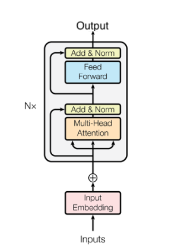

# Formula1-Strategy

# Description

This project uses the Transformer model from the paper 'Attention is all you need', to predict the location of all drivers in a race in Formula one. 

## Model Description

The model we will be using is as shown below. 

The number of layers and heads were decided with hyperparameter tuning using *Optuna*. Each hidden feedforward network layer and attention layer used GELU as its activation function. 

The objective function was an altered custom MAE function that was needed to correct some of the losses the model was incorrectly classifying. 

The Adam optimizer was used to optimize the parameter space. 

## Data Description 

The data is consisted of 927 columns and around 430000 rows. For each driver we have, 

|  Feature | Type | Description |
| --- | --- | --- |
| Date | TimeDelta | The timestamp of when the data was collected |
| SessionDate | TimeDelta | The relative timestamp of the session |
| RPM | int | The RPM of the vehicle |
| Speed | int | The speed of the vehicle |
| nGear | int | The gear status of the vehicle |
| Throttle | int | The % of throttle pressure |
| Brake | Bool | The brake status |
| DRS | Bool | The DRS status |
| X | int | X position (1/10 m) |
| Y | int | Y position (1/10 m) |
| Z | int | Z position (1/10 m) |
| Status | Cat (str) | Current status of the driver (DNF, Finished etc) |
| TrackStatus | Cat (str) | Flag (Yellow flag, Safety Car, Red Flag, Virtual Safety Car) | 
| Compound | Cat (str)|The Tyre Compound (Soft, Medium, Hard, Intermediate, Wet) |
| PitIn | Bool | Driver pit in status |
| PitOut | Bool | Driver pit out status |
| Distance | int | The total distance driven for the lap |
| Corner | int| The distance to the nearest turn |
| Angle | Cat (str) | The severity of the turn divided into 4 classes (Low (0-45), Med-Low (45-90), Med-High (90-120), High (120-180)) |
| Acc_Distance | int | The accumulated distance driven by the driver for the entire race |

Then we will also add weather related data

| Feature | Type | Description |
| --- | --- | --- |
| AirTemp | Int | Temperature |
| Humidity | Int | Humidity |
| Pressure | Int | Air pressure|
| RainFall | bool | Show if there is rainfall |
| TrackTemp | Int | Temperature of the track |
| WindDirection | Int | Direction of the wind |
| WindSpeed | Int | Speed of the wind | 

We will then group each rows with 50 rows, with one-hot encoding and some feature engineering (50, 927) and use this to predict the next consecutive 100 positions of the drivers (50, 40). The position will be measure using the **Distance** column. 

# Results

# How to Run

First install the libraries

It uses data from the FastF1 API to collect telemetry data from a single race and with the transformer model estimate where a driver will be after a certain number of data points. 
Specifically, it collects 6 seconds worth of data to predict where each driver would be in the next 12 seconds. Using the distance information we will predict where the driver will be in terms of distance in the next 12 seconds. The racetrack selected for this project was the 2023 Bahrain Grand Prix.

Data:

The reasons for selecting the 2023 Bahrain Grand Prix are as follows:
1. 2022 was the last major rule change made by the FIA hence any data before 2022 has major car design changes the model cannot capture
2. During 2022 and 2023 the changes made to the vehicles in terms of design, engine and functionality were quite significant and this is shown in the data-analysis file
3. The Bahrain Grand Prix was the first race of the 2023 season, thus making it a relatively fair race for all teams as it was the race with the least amount of changes

